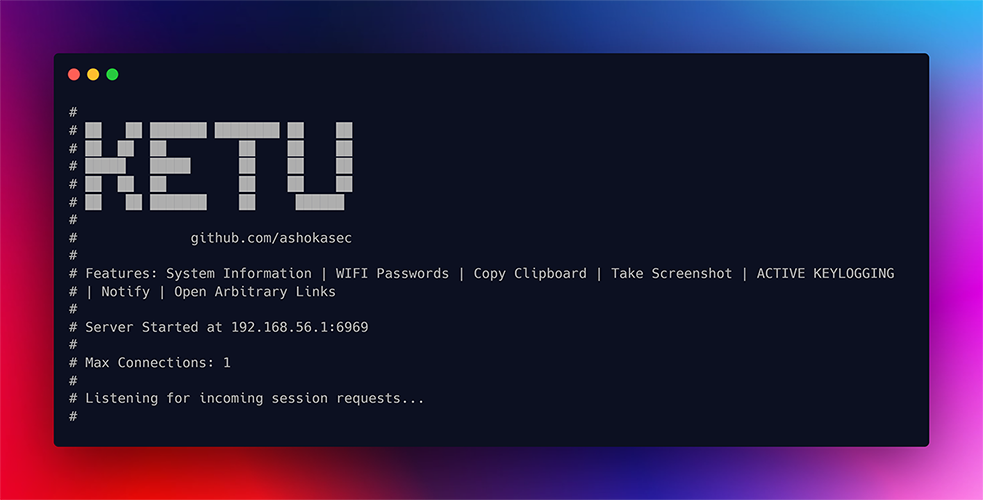

# Ketu: Remote Control and Surveillance Tool

> Hey, this tool isn't quite ready for everyone to use. I built it for myself to learn how things work behind the scenes.

__Ketu__ is a cybersecurity project designed for remote control and monitoring. It offers a range of features to gather system information, retrieve WIFI passwords, manage the clipboard, send notifications, open links, capture screenshots, and implement keylogging.

> Disclaimer: This tool should be used responsibly for educational purposes only. Its use for any malicious activities is strictly discouraged. The developers and contributors are not liable for any misuse. Always respect ethical and legal standards while using this tool.



## Features

- **System Information:** Retrieve detailed system information from the connected client.
- **WIFI Passwords:** Display past connected WIFI SSIDs and their corresponding passwords.
- **Clipboard Management:** Copy the client's clipboard content.
- **Notifications:** Send a notification to the client.
- **Open Links:** Open a provided link in the client's default web browser.
- **Screenshot Capture:** Capture and receive a screenshot from the client.
- **Keylogging:** Fetch the key log file from the client.

## Bonus - Data Visualization and Data Handling

The project includes a web interface (`index.html`) to visualize collected data. Open `index.html` in a web browser to view System Information, WIFI Passwords, and Clipboard content.

### Data Handling

Data is exported and imported in JSON format. The Python `json` module is utilized for this purpose. Collected data is stored in a `data.json` file. The web interface dynamically renders this data for visualization.

__Data Structure (JSON) in data.json__

```json
{
  "sysinfo": {
    "Username": "example_user",
    "Home Directory": "/home/example_user",
    "System": "Linux",
    "Node Name": "example-node",
    "Release": "4.15.0-112-generic",
    "Version": "#113-Ubuntu SMP Thu Jul 9 23:41:39 UTC 2020",
    "Machine": "x86_64",
    "Processor": "Intel(R) Core(TM) i7-8700 CPU @ 3.20GHz"
  },
  "show_wifi": [
    {"SSID": "WiFiNetwork1", "Password": "password1"},
    {"SSID": "WiFiNetwork2", "Password": "password2"}
  ],
   "cp_clipb": "Clipboard content goes here."
}
```

### Rendering Data

The web interface utilizes __JavaScript__ to dynamically render the collected data. Data from the `data.json` file is fetched __asynchronously__, and HTML elements are created based on the data's structure.

## Getting Started

1. **Clone the Repository:**

```bash
git clone https://github.com/ashokasec/ketu.git
cd ketu
```

2. **Install Dependencies:**

```bash
pip install -r requirements.txt
```

3. **Run the Server:**

```bash
python server/server.py
```

4. **Run the Client:**

```bash
python client/client.py --address SERVER_IP
```
Replace `SERVER_IP` with the actual IP address where the server is running.

## Usage

| Command          | Description                                             |
| ---------------- | ------------------------------------------------------- |
| sysinfo         | Retrieve detailed system information from the client.   |
| show_wifi       | Display past connected WIFI SSIDs and passwords.        |
| cp_clipb        | Copy the client's clipboard content.                    |
| notify          | Send a notification to the client.                      |
| open_link       | Open a provided link in the client's browser.           |
| screenshot      | Capture and receive a screenshot from the client.       |
| get_keys        | Fetch the key log file from the client.                 |

## Thank You!

Thank you for exploring KETU! We hope you found it insightful and beneficial for your knowledge.

⭐ **Star the Repository**: If you found KETU interesting, consider giving it a star. Your support means a lot!

Happy learning! 🚀


